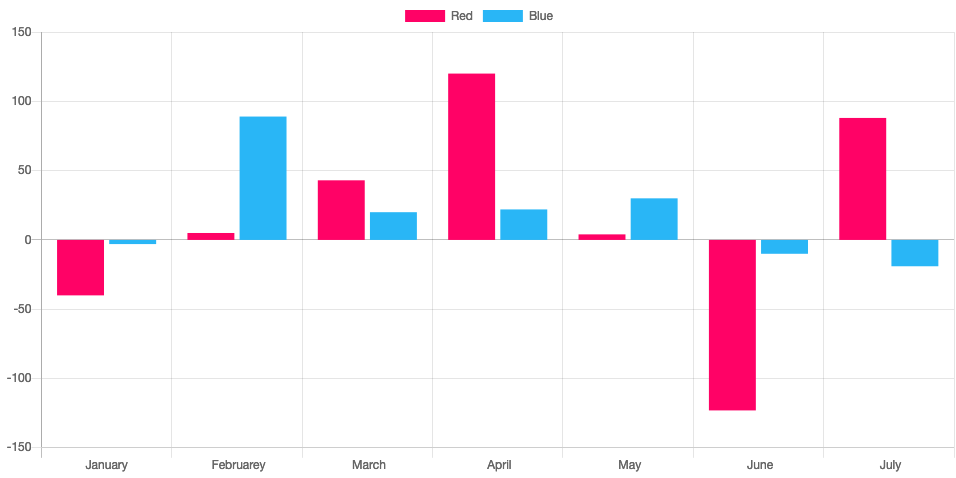
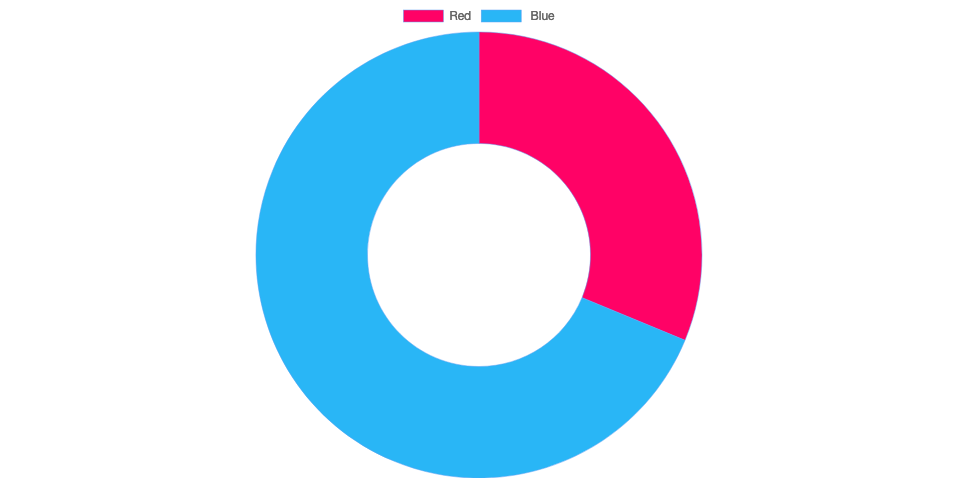
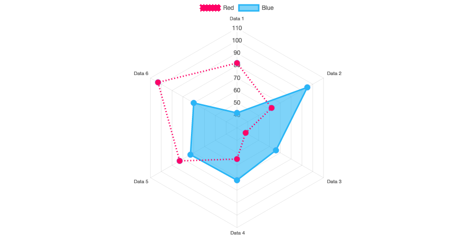

# Shortcode Chart.js++ Plugin

## About

The **Shortcode Chart.js++** Plugin is an extension for [Grav CMS](http://github.com/getgrav/grav). A shortcodes extension to add [Chart.js](https://www.chartjs.org/) charts to your Grav website.

## Installation

### Preferred way: GPM Installation

To install the plugin via the [GPM](http://learn.getgrav.org/advanced/grav-gpm), navigate to the root of your Grav-installation, and enter:

    bin/gpm install shortcode-chart-js-plusplus

This will install this plugin into your `/user/plugins`-directory within Grav. Its files can be found under `/your/site/grav/user/plugins/shortcode-chart-js-plusplus`.

### Manual Installation
	
> NOTE: This plugin is a modular component for Grav which requires the [Grav Shortcode Core Plugin
](https://github.com/getgrav/grav-plugin-shortcode-core) to be installed.

To install the plugin manually, download the zip-version of this repository and unzip it under `/your/site/grav/user/plugins`. Then rename the folder to `shortcode-chart-js-plusplus`. You can find these files on [GitHub](https://github.com/sal0max/grav-plugin-shortcode-chart-js-plusplus) or via [GetGrav.org](http://getgrav.org/downloads/plugins#extras).

### via Admin Plugin

If you use the Admin Plugin, you can install the plugin directly by browsing the `Plugins`-menu and clicking on the `Add` button.

## Configuration

Before configuring this plugin, you should copy the `user/plugins/shortcode-chart-js-plusplus/shortcode-chart-js-plusplus.yaml` to `user/config/plugins/shortcode-chart-js-plusplus.yaml` and only edit that copy.

Alternatively, use the Admin Plugin. It takes car of creating a file with your configuration named `shortcode-chart-js-plusplus.yaml` to be created in the `user/config/plugins/`-folder once the configuration is saved in the Admin.

## Usage

You can use basically all Chart.js options as discribed [here](https://www.chartjs.org/docs/).  
Have a look at the following examples.

### Bar Chart



```
[chart
    type="bar"
    labels="[January, Februarey, March, April, May, June, July]"]
    [canvas
        width="300"
        height="150"]
    [dataset
        backgroundColor="#ff0266"
        data="[-40, 5, 43, 120, 4, -123, 88]"
        label="Red"]
    [dataset
        backgroundColor="#29b6f6"
        data="[-3, 89, 20, 22, 30, -10, -19]"
        label="Blue"]
    [options
        responsive="true"]
[/chart]
```

### Doughnut



```
[chart
    type="doughnut"
    labels="[Red, Blue]"]
    [canvas
        width="300"
        height="150"]
    [dataset
        backgroundColor="[#ff0266, #29b6f6]"
        borderWidth="0"
        data="[40, 88]"]
    [options
        responsive="true"]
[/chart]
```

### Line Chart


```
[chart
    type="line"
    labels="[January, Februarey, March, April, May, June, July]"]
    [canvas
        width="300"
        height="150"]
    [dataset
        borderColor="#ff0266"
        borderDash="[2, 4]"
        data="[-40, 1, -43, 20, -1, -100, 88]"
        fill="false"
        label="Red"
        pointBackgroundColor="#ff0266"
        pointBorderColor="#ff0266"
        pointRadius="8"]
    [dataset
        backgroundColor="#29b6f699"
        borderColor="#29b6f6"
        data="[-1, -89, 20, -22, 30, -10, -19]"
        fill="true"
        label="Blue"
        pointBackgroundColor="#29b6f6"
        pointBorderColor="#29b6f6"]
    [options
        responsive="true"]
[/chart]
```

### Radar



```
[chart
    type="radar"
    labels="[Data 1, Data 2, Data 3, Data 4, Data 5, Data 6]"]
    [canvas
        id="test"
        width="300"
        height="150"]
    [dataset
        backgroundColor="#ff026644"
        borderColor="#ff0266"
        borderDash="[2, 4]"
        data="[82, 62, 38, 55, 83, 103]"
        fill="false"
        label="Red"
        pointBackgroundColor="#ff0266"
        pointBorderWidth="0"
        pointRadius="6"]
    [dataset
        backgroundColor="#29b6f699"
        borderColor="#29b6f6"
        data="[42, 95, 66, 72, 73, 70]"
        label="Blue"
        pointBackgroundColor="#29b6f6"
        pointBorderWidth="0"
        pointRadius="6"]
    [options
        responsive="true"]
[/chart]
```

## Credits

Couldn't be possible without the awesome [Chart.js](https://www.chartjs.org/) library. Thanks so much!  
Code inspired by the old [grav-plugin-shortcode-chartjs](https://github.com/CPPL/grav-plugin-shortcode-chartjs) plugin, which doesn't seem to be developed any more.